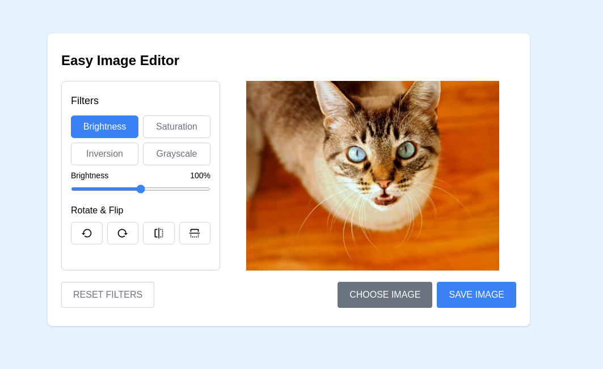

# Easy Image Editor using Tailwind CSS, VueJS

Recreated from the [Build An Image Editor in HTML CSS & JavaScript | Image Editor in JavaScript](https://youtu.be/YqUUvBpCtfA)



## Install and run

```
yarn && yarn dev
```

## TODO

- Refactoring vue code